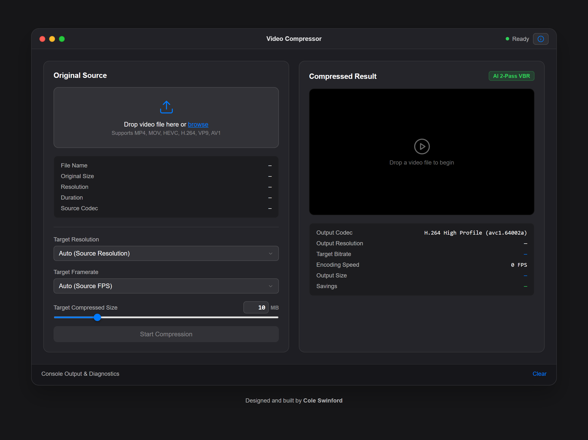

# [Local AI Video Compressor](https://video-compressor.coleswinford.com/)

Client-side video compressor using in-browser ONNX models and WebCodecs hardware acceleration to hit exact target file sizes without server uploads.

  

## Overview

Most web video tools require uploading source files to a backend server, consuming bandwidth and exposing media to third-party infrastructure. This application offloads decoding, scene complexity analysis, and encoding entirely to client hardware using modern browser APIs.

## Key Features & Architecture

- **Two-Pass AI Bitrate Allocation:** Runs an ONNX vision model (224x224) via WebAssembly/WebGPU to analyze frame-by-frame scene complexity in Pass 1, dynamically scaling VBR bitrate allocation before encoding in Pass 2.
- **Hardware-Accelerated Encoding:** Taps directly into native GPU/CPU hardware video codecs via the browser's `VideoEncoder` and `VideoDecoder` WebCodecs APIs.
- **Strict Target Sizing:** Accounts for frame headers and container metadata to ensure final outputs stay below strict target file size limits (e.g., Discord or email attachments).
- **Audio Passthrough:** Demuxes and remuxes original AAC streams directly into the destination MP4 container using `mp4box.js`, bypassing audio re-encoding entirely to avoid generation loss and audio drift.
- **Color Space Preservation:** Retains standard Rec.709 SDR color mapping to prevent gamma shifting common in canvas-based frame extraction.

## Tech Stack

- **Core APIs & Runtimes:** WebCodecs API, ONNX Runtime Web, WebAssembly (WASM), WebGPU
- **Languages & Tooling:** TypeScript, Vite, `mp4box.js`

