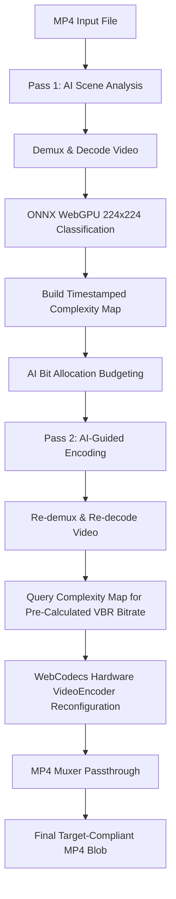

# WebCodecs Two-Pass AI Video Compressor Architecture

## Overview
This project implements a client-side video compression pipeline using a **Two-Pass AI Architecture**. The entire pipeline executes locally without server dependencies, combining WebCodecs for hardware-accelerated video decoding/encoding, WebGPU/ONNX for AI scene complexity estimation, and dynamic Two-Pass Variable Bitrate (VBR) budget allocation to guarantee strict adherence to user-specified target file size constraints while maximizing visual fidelity.

---

## Two-Pass AI Compression Stages

### Stage 1: Pass 1 — AI Scene Complexity Analysis (`isAnalysisPass = true`)
- **Responsibility**: Scans the input MP4 file to measure spatial and temporal scene complexity per frame without emitting encoded bitstream.
- **Key Tasks**:
  - Demuxes file in 1 MB chunks with disk read backpressure.
  - Decodes video frames via WebCodecs `VideoDecoder`.
  - Performs 224x224 GPU downscaling via `createImageBitmap` and runs ONNX WebGPU classification every 15 frames (`inferenceStride = 15`).
  - Records `{ timestamp, score }` entries in an in-memory `complexityMap`.
  - Disposes decoded frames immediately (`frame.close()`) to maintain low memory usage.

### Stage 2: Inter-Pass Bit Allocation Budgeting
- **Responsibility**: Computes precise VBR bitrate targets for every frame timestamp based on global AI complexity distribution.
- **Key Tasks**:
  - Sums all complexity scores across `complexityMap` ($S_{\text{total}} = \sum \text{score}_i$).
  - Calculates total target video bits:
    $$\text{TargetVideoBits} = (\text{TargetMB} \times 8,388,608) - (\text{AudioBitrate} \times \text{DurationSec})$$
  - Computes weighted segment bit budget and target bitrate per frame:
    $$\text{Weight}_i = \frac{\text{score}_i}{S_{\text{total}}}, \quad \text{TargetBitrate}_i = \frac{\text{TargetVideoBits} \times \text{Weight}_i}{\text{SegmentDurationSec}_i}$$

### Stage 3: Pass 2 — AI-Guided Video Encoding (`isAnalysisPass = false`)
- **Responsibility**: Re-reads the source MP4 file from the beginning and encodes every frame using pre-calculated VBR bitrates.
- **Key Tasks**:
  - Re-initializes `Demuxer` to re-read file chunks from offset 0.
  - Configures `Display-P3` 2D `OffscreenCanvas` for hardware-accelerated HDR-to-SDR tone mapping.
  - As frames decode, queries `complexityMap` using `frame.timestamp` to retrieve its pre-calculated `targetBitrate`.
  - Reconfigures `VideoEncoder` dynamically on-the-fly (`encoderPipeline.reconfigureBitrate(targetBitrate)`).
  - Passes new 1080p `VideoFrame` instances (with explicit `timestamp` and `duration` passthrough) to `VideoEncoder`.
  - Multiplexes encoded video chunks and original raw audio chunks (Audio Passthrough) into `mp4-muxer`.
  - Finalizes downloadable MP4 Blob adhering strictly to user target MB limits.

---

## Resource & Synchronization Constraints

> [!IMPORTANT]
> **Disk Read Backpressure**:
> Monitored in `checkBackpressure()` during chunked disk reading:
> `while (decoder.decodeQueueSize > 5 || encoder.encodeQueueSize > 5) await new Promise(r => setTimeout(r, 10));`
> Physically pauses disk reading to prevent memory thrashing.

> [!IMPORTANT]
> **Timestamp Passthrough**:
> All re-created `VideoFrame` instances **MUST** specify explicit `timestamp` and `duration` attributes matching the original decoded frame.
